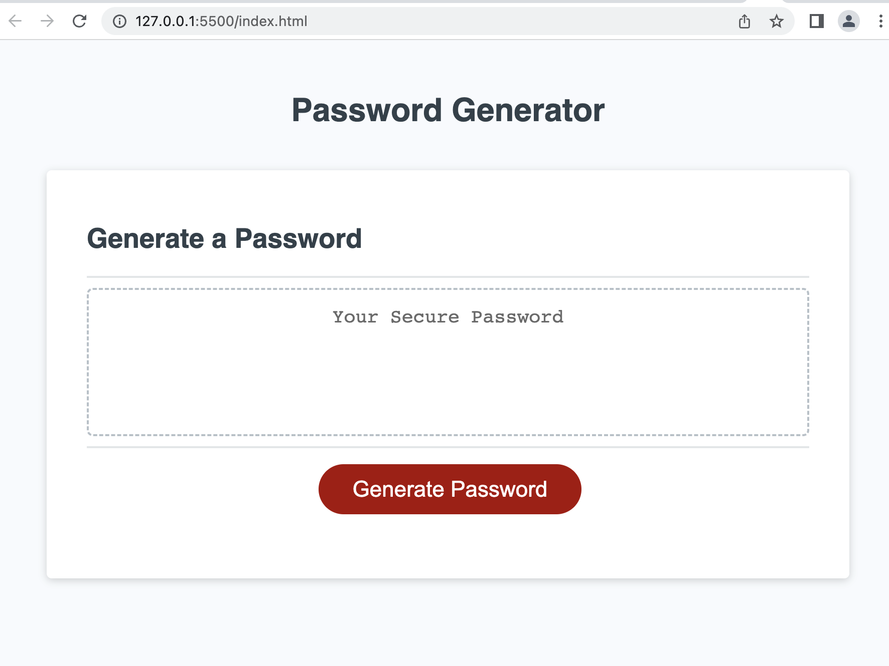

# Password Generator

## Password Generator for Security

A webpage that generates a random secure password based on criterias selected by the user. 
- A random password is recommended as it adds difficulty for others to replicate and access a user's data
- An add-on to minimize risk of access to personal, business or sensitive data 

## Installation

Webpage consist of html, JavaScript and CSS. 
- ensuring the JavaScript works to provide a random characters each time

## Usage

- Click on the 'Generate Password' Button. 
- Follow the prompts and enter criterias (example: 12 character length, okay to numbers, special characters, no upper case letters).
- Copy password generated on the screen for reference

```md

```

## Credits
Reference and sources from w3schools.com, developer.mozilla.org

## License

None
